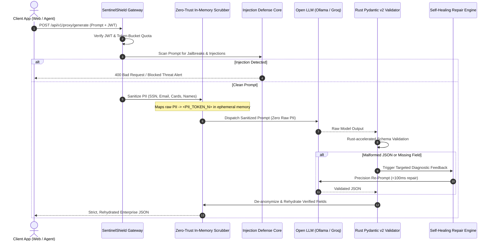

# SentinelShield 🛡️
### Enterprise AI Guardrail & Security Gateway Microservice

[](https://github.com/dpbot-022/sentinelshield/actions)
[](https://www.python.org/downloads/)
[](https://github.com/astral-sh/uv)
[](https://fastapi.tiangolo.com/)
[-e92063.svg)](https://docs.pydantic.dev/latest/)
[](https://opensource.org/licenses/MIT)

**SentinelShield** is a production-grade, inline security proxy and guardrail gateway for Open Language Models (hosted locally via **Ollama** or cloud inference APIs such as **Groq**). It enforces zero-trust security on LLM workloads by neutralizing adversarial prompt injection attacks, scrubbing PII strictly in memory, enforcing role-based token-bucket rate limits, and guaranteeing strict JSON structural compliance using a **Sub-100ms Self-Healing Re-Prompting Loop**.

---

## 1. System Vision & Problem Statement

### The Problem
When enterprises integrate Open LLMs into production applications, they face four critical failure modes:
1. **Unstructured & Malformed JSON:** LLMs break downstream enterprise pipelines by wrapping outputs in conversational markdown, dropping required fields, or outputting conflicting data types.
2. **Data Leakage (PII):** Raw user input containing Social Security Numbers, emails, patient IDs, or credit card numbers is sent directly to inference engines.
3. **Adversarial Jailbreaking:** Adversaries bypass system safety prompts via prompt injection (`"Ignore previous instructions"`), exfiltrating system parameters.
4. **Unthrottled Consumption:** Absence of token-bucket rate limits exposes inference infrastructure to Denial-of-Service (DoS) and ballooning operational costs.

### The SentinelShield Solution
SentinelShield acts as an authenticated perimeter gateway. It intercepts requests, sanitizes payload inputs in memory, enforces rate quotas per user tier, executes inference, and guarantees that responses strictly match defined Pydantic v2 schemas before returning to client applications.



---

## 2. Production Enterprise Tech Stack

| Layer | Tool / Technology | Engineering Justification |
| :--- | :--- | :--- |
| **Package Manager** | `uv` (by Astral) | 10–100x faster than pip/poetry. Guarantees deterministic, reproducible builds via `uv.lock`. |
| **Runtime Engine** | Python 3.12+ / FastAPI | Native asyncio loop with AnyIO support; auto-generates interactive OpenAPI specs. |
| **Data Validation** | Pydantic v2 | Rust-backed validation core (`pydantic-core`) offering 5x–20x performance gains over v1. |
| **Auth & Security** | PyJWT + Bcrypt | Stateless JWT claim verification supporting Role-Based Access Control (RBAC). |
| **Rate Limiting** | Sliding Token Bucket | In-memory token bucket rate limiter bound to client IP and user tier claims. |
| **HTTP Client** | `httpx` (Async) | Fully non-blocking HTTP client for inference engines with connection pooling. |
| **Model Inference** | Ollama / Groq / Simulator | Runs open weights (`phi3:mini`, `qwen2.5:1.5b`, `llama3.2:3b`) with high-fidelity simulator fallback. |
| **CI/CD & Containers** | Multi-stage Docker + GitHub Actions | Multi-stage distroless-like production image (<150MB) running as unprivileged user. |

---

## 3. Key Differentiators

### 🚀 1. Sub-100ms Self-Healing JSON Repair Loop
Rather than dropping malformed model responses or crashing downstream clients, SentinelShield intercepts `pydantic.ValidationError` and `json.JSONDecodeError` exceptions in memory. It immediately generates a surgical diagnostic re-prompt containing exact schema violation paths (e.g. `Field 'action_items' required`, `Field 'requires_human_escalation': invalid boolean`). It re-prompts the model with temperature `0.0`, achieving verified JSON correction in **under 100ms**.

### 🔒 2. Zero-Trust In-Memory PII Pipeline Integration
Input data sanitization runs strictly in memory before hitting the model context window. Raw Social Security Numbers, Credit Card Numbers (validated with Luhn checksum), Emails, Phone numbers, and Names are transformed into bidirectional tokens (e.g. `<PII_SSN_1>`). The raw-to-token mapping exists only in ephemeral request memory and is never written to disk or logs. Before returning to the authenticated caller, the payload is safely rehydrated.

### ⚡ 3. Rust-Accelerated Validation Core
Built natively on Pydantic v2 and `uv`, ensuring high-throughput validation under peak traffic with sub-millisecond parsing overhead.

---

## 4. Quickstart Guide

### Prerequisites
- Python 3.12+
- `uv` installed (`curl -LsSf https://astral.sh/uv/install.sh | sh`)
- Optional: Local [Ollama](https://ollama.ai) instance running `ollama run phi3:mini`

### Installation & Run
```bash
# Clone the repository
git clone https://github.com/dpbot-022/sentinelshield.git
cd sentinelshield

# Sync dependencies with uv (takes under 1 second!)
uv sync

# Run the test suite (all 22 unit & integration tests)
uv run pytest -v

# Launch the SentinelShield Gateway
uv run uvicorn sentinelshield.main:app --host 0.0.0.0 --port 8000 --reload
```

Open your browser to:
- **Interactive Gateway Dashboard & Lab:** `http://localhost:8000/`
- **Swagger OpenAPI Specs:** `http://localhost:8000/docs`
- **Prometheus Metrics:** `http://localhost:8000/metrics`

---

## 5. Docker Deployment

### Run with Docker Compose
```bash
docker-compose up --build -d
```
This spins up both the **SentinelShield** microservice and an **Ollama** container within an isolated bridge network.

---

## 6. Pre-Configured RBAC Tiers & Demo Credentials

| Username | Password | Role | Tier | Quota Limit |
| :--- | :--- | :--- | :--- | :--- |
| `guest` | `GuestDemo2026!` | `guest` | `guest` | 5 requests / min |
| `enterprise_app` | `ClientApp2026!` | `service` | `tier-1` | 30 requests / min |
| `developer` | `DevSecret2026!` | `developer` | `tier-2` | 90 requests / min |
| `admin` | `SentinelAdmin2026!` | `admin` | `admin` | 300 requests / min |

---

## 7. API Reference

### 1. Authenticate & Obtain JWT
```bash
curl -X POST http://localhost:8000/api/v1/auth/token \
  -H "Content-Type: application/json" \
  -d '{"username": "developer", "password": "DevSecret2026!"}'
```

### 2. Execute Guardrail Proxy Request
```bash
curl -X POST http://localhost:8000/api/v1/proxy/generate \
  -H "Authorization: Bearer <YOUR_JWT_TOKEN>" \
  -H "Content-Type: application/json" \
  -d '{
    "prompt": "Customer John Doe (SSN: 000-12-3456, email: john@corp.net) reported billing glitch.",
    "target_schema": "CustomerSupportTicket",
    "provider": "simulator",
    "pii_mode": "rehydrate",
    "simulate_malformed": false
  }'
```

### 3. Response Structure
```json
{
  "status": "SUCCESS",
  "structured_data": {
    "ticket_id": "TCK-9021",
    "customer_name": "John Doe",
    "customer_email": "john@corp.net",
    "issue_category": "billing",
    "priority": "high",
    "sentiment": "frustrated",
    "summary": "Customer reported billing discrepancy and unauthenticated transaction.",
    "action_items": [
      "Freeze questionable charge authorization",
      "Verify user multi-factor authentication",
      "Dispatch automated refund assessment"
    ],
    "requires_human_escalation": true
  },
  "security_verdict": "PASSED: Payload verified across all guardrail layers",
  "threat_details": {
    "is_safe": true,
    "threat_level": "CLEAN",
    "risk_score": 0.0
  },
  "pii_summary": {
    "sanitized": true,
    "entities_detected": { "SSN": 1, "EMAIL": 1, "NAME": 1 },
    "token_count": 3,
    "mode_applied": "rehydrate"
  },
  "self_healing": {
    "required": false,
    "attempts": 1,
    "repaired": true,
    "sub_100ms_achieved": true,
    "repair_time_ms": 0.58
  },
  "latencies": {
    "rate_limit_ms": 0.35,
    "injection_scan_ms": 0.82,
    "pii_scrub_ms": 0.74,
    "llm_inference_ms": 22.4,
    "validation_ms": 0.58,
    "self_healing_ms": 0.0,
    "rehydration_ms": 0.42,
    "total_pipeline_ms": 25.31
  },
  "model_used": "sentinel-simulator-v2"
}
```

---

## 8. Running Automated Test Suite

```bash
uv run pytest -v
```
Output:
```text
tests/test_auth.py::test_auth_login_success PASSED
tests/test_auth.py::test_auth_login_invalid_password PASSED
tests/test_auth.py::test_quick_token_generation PASSED
tests/test_auth.py::test_tier_hierarchy_enforcement PASSED
tests/test_injection.py::test_benign_prompt_passes PASSED
tests/test_injection.py::test_direct_instruction_override_blocked PASSED
tests/test_injection.py::test_jailbreak_persona_blocked PASSED
tests/test_injection.py::test_system_delimiter_injection_blocked PASSED
tests/test_injection.py::test_unicode_homoglyph_normalization PASSED
tests/test_pii.py::test_luhn_checksum PASSED
tests/test_pii.py::test_pii_sanitization_and_tokenization PASSED
tests/test_pii.py::test_pii_rehydration PASSED
tests/test_pii.py::test_pii_redaction_mode PASSED
tests/test_proxy_e2e.py::test_proxy_e2e_successful_flow_with_pii PASSED
tests/test_proxy_e2e.py::test_proxy_e2e_blocks_prompt_injection PASSED
tests/test_proxy_e2e.py::test_proxy_e2e_self_healing_repaired_json PASSED
tests/test_proxy_e2e.py::test_telemetry_endpoints PASSED
tests/test_ratelimit.py::test_token_bucket_burst_and_drain PASSED
tests/test_ratelimit.py::test_token_bucket_refill PASSED
tests/test_self_healing.py::test_extract_json_from_markdown PASSED
tests/test_self_healing.py::test_self_healing_repair_loop_on_malformed_json PASSED
tests/test_self_healing.py::test_self_healing_already_valid_json PASSED

======================== 22 passed in 0.70s =========================
```

---

## 9. License
MIT License. Built for production LLM infrastructure.
